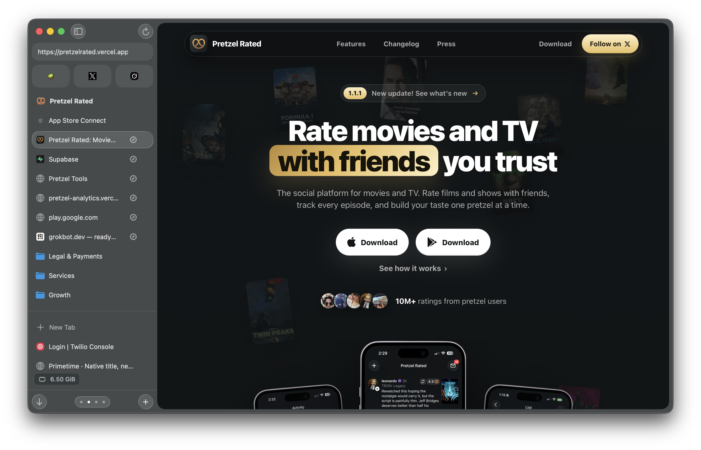
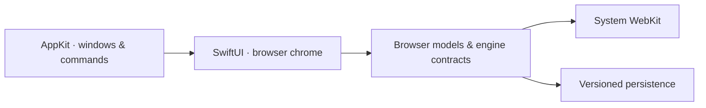

<p align="center">
  
</p>

<h1 align="center">Cobble</h1>
<p align="center">A native Mac browser. A quieter place for your tabs.</p>

<p align="center">
  
  
  
</p>

<p align="center">
  <a href="#build">Build</a> · <a href="ARCHITECTURE.md">Architecture</a> · <a href="FEATURES.md">Features</a> · <a href="ROADMAP.md">Roadmap</a>
</p>



## A home for your browsing

| 🪨 Make it yours | 🗂 Keep your place | ⌨ Stay in flow |
| --- | --- | --- |
| Native themes, fonts, and accents | Spaces, favorites, pins, and folders | Command bar and customizable shortcuts |
| SwiftUI chrome with AppKit windows | Independent windows and session recovery | Local tab search and native menus |

WebKit renders the web. Cobble owns the browser around it: organization, profiles, downloads, permissions, history, and recovery. English and Spanish UI. No telemetry or AI chrome.

## Under the surface



Engine-neutral contracts keep browser state separate from rendering. Saved organization is shared; live tabs and selection belong to each window. Private tabs stay out of session snapshots.

Use system WebKit or the experimental [Chromium SDK](https://github.com/ignaciojuarez/cobble-chromium). Both projects publish their source. Chromium requires a separate engine build; **it isn’t required for WebKit**. See [Chromium build instructions](CHROMIUM.md).

## Build

Requires macOS 26+ and Xcode. The command below was verified with **Xcode 27.0**. Open `Cobble.xcodeproj` and use the **Cobble** scheme, or build without signing:

```sh
DEVELOPER_DIR=/Applications/Xcode.app/Contents/Developer \
  xcodebuild -project Cobble.xcodeproj -scheme Cobble \
  -configuration Debug -destination 'platform=macOS' \
  -derivedDataPath .build/webkit CODE_SIGNING_ALLOWED=NO build
```

The app is at `.build/webkit/Build/Products/Debug/Cobble.app`. Replace `build` with `test` to run the isolated hosted tests. Signed capabilities require your own development identity and applicable Apple entitlements.

`./Scripts/test.sh` runs the hosted tests directly. `swift build` / `swift test` build and check the Chromium client against the pinned SDK; they do not compile Chromium itself. The optional `Scripts/run.sh` wrapper uses a separate build-kit checkout.

## Still in development

**No signed public download is available yet.** Source availability is separate from a production browser release. Apple Passwords/passkeys, accessibility, real-site compatibility, signed distribution, updates, and daily-use qualification still have open gates.

→ [Authentication checklist](docs/features/passwords.md) · [Apple browser requirements](docs/features/apple-browser.md) · [Release gates](ROADMAP.md)

**License:** [GNU GPLv3](LICENSE) (`GPL-3.0-only`) for original project code. [Third-party notices](THIRD_PARTY_NOTICES.md).
